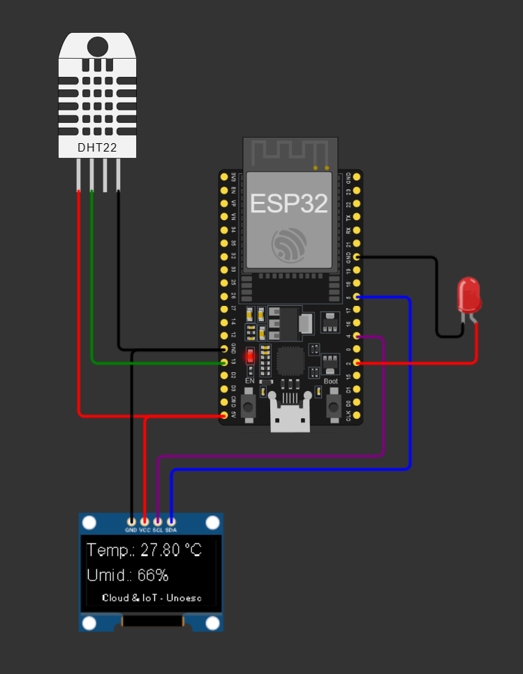
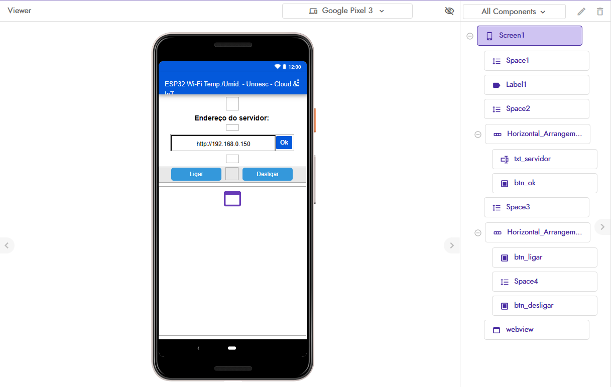
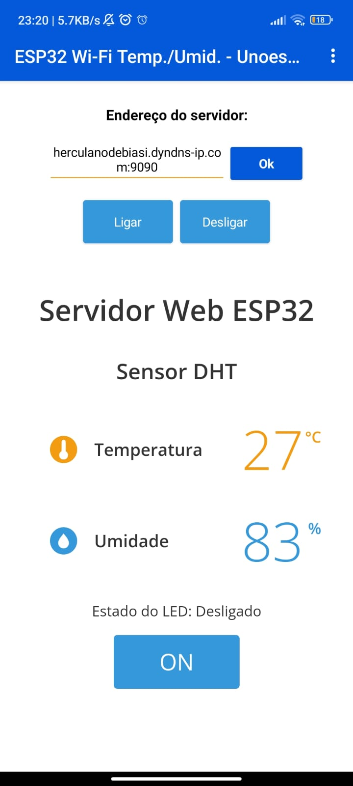

# Trabalho final da matéria de Computação em Nuvem e Internet das Coisas

## Simulação de controlador utilizando a plataforma Wokwi

## Projeto do aplicativo utilizando a plataforma Kodular

## Aplicativo

